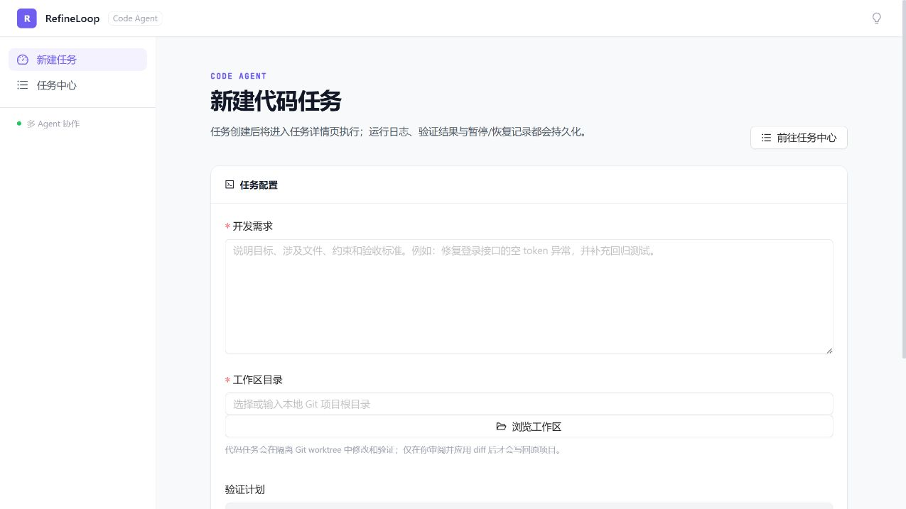

# RefineLoop（智炼回路）

> 可验证、可恢复、可人工审批的本地代码 Agent 工作台。

[](https://github.com/wlunan/refine-loop/actions/workflows/ci.yml)
[](https://www.python.org/)
[](https://vuejs.org/)
[](./LICENSE)

RefineLoop 不把模型的“看起来不错”当作任务完成。它让 Agent 在隔离 Git worktree 中修改代码，用测试、构建或 lint 的真实结果判断是否继续修复；验证通过后，用户仍需审阅 diff 并决定应用或丢弃变更。



## 项目亮点

- **验证驱动修复**：把 pytest、lint、Python 脚本和 Node build 的退出结果作为完成条件，失败证据自动进入下一轮。
- **受控代码修改**：Git 项目默认在隔离 worktree 中执行，完成后生成变更集供人工审批。
- **持久化与恢复**：保存任务、检查点、工具调用、JSONL Trace 和 artifact，支持暂停、重启恢复与页面回放。
- **上下文与成本控制**：消息滑窗、焦点文件快照、失败摘要、Token 预算和停止条件共同限制长任务成本。
- **完整工程交付**：FastAPI + Vue 3 单端口应用，包含离线测试、CI、指标、Docker Compose 和固定故障 Demo。

```text
需求 → 任务规划 → 隔离 worktree → Agent 修改 → 确定性验证
                                      ↑          ↓ 失败证据
                                      └── Critic / 修复迭代
                                                   ↓ 通过
                                         Diff 审阅 → 应用 / 丢弃
```

## 90 秒固定 Demo

先生成一个可随时重置、带失败测试的独立 Git 仓库：

```Shell
python scripts/prepare_demo.py
```

启动 RefineLoop 后选择脚本输出的目录，并输入：

> 修复 `src/cart.py` 的价格计算与输入校验问题，使全部测试通过。保持 `calculate_total` 的函数签名不变，不要修改测试。

可以观察到：pytest 首轮失败 → 失败证据回注 → Agent 修复 → pytest 通过 → 审阅并应用 diff。再次运行准备脚本即可恢复初始故障。

## 架构设计

```
用户输入 → Orchestrator → Generator → Critic → (判断收敛) → 是 → 输出结果
                                          ↓ 否
                                       Generator（基于反馈修改）
```

### 核心组件

| 组件                          | 职责                                                                       |
| --------------------------- | ------------------------------------------------------------------------ |
| **GeneratorAgent**          | 根据任务和批判反馈生成/优化产出，支持文本模式和文件操作模式                                           |
| **CriticAgent**             | 审查产出，输出结构化的批判结果（评分、问题、建议），含三级降级解析                                        |
| **Orchestrator**            | 控制迭代流程，管理状态，判断收敛，支持流式 token 回调与线程安全中断                                    |
| **GeneratorCriticGraph**    | 基于 LangGraph 的图状态机实现（可选）                                                 |
| **TaskManager**             | 长时间运行任务的全生命周期管理（创建→分解→执行→暂停/恢复/取消）                                       |
| **ToolAgent**               | 混合模式工具调用执行器，支持原生 Function Calling 和 JSON 文本协议降级                          |
| **FileWorkspace**           | 文件安全沙箱，限制 Agent 的所有文件操作在指定目录内                                            |
| **可验证工具集**                  | `run_tests` / `run_lint` / `run_command` / `run_python`，让审查基于真实执行结果而非纯文本 |
| **SelfHealingOrchestrator** | 代码自愈闭环：生成 → 验证 → 失败定位 → 修复 → 复跑                                          |

### 收敛机制

三种终止条件，满足任一即停止（由 `src/convergence.py` 纯函数统一判定，供 Orchestrator 和 LangGraph 共用）：

1. **质量达标**：Critic 评分 ≥ 阈值（默认85）且 `acceptable=true` → 成功收敛
2. **无新反馈**：连续 N 轮（默认2轮）审查问题完全相同 → 成功收敛
3. **最大轮数**：达到配置的最大迭代轮数（默认5轮）→ 未收敛，返回历史最优版本

### 成本控制

| 策略           | 说明                                         |
| ------------ | ------------------------------------------ |
| **模型分级**     | Generator 用强模型，Critic 可用弱模型（挑刺比创作对能力要求低）   |
| **Token 预算** | 总预算 + 单轮预算双重控制，超预算自动终止                     |
| **提前终止**     | 质量达标 / 无新反馈立即停止，不浪费 token                  |
| **最优版本返回**   | 未收敛时返回历史评分最高的版本，而非最后一版（迭代非单调上升）            |
| **可中断**      | `Orchestrator.stop()` 线程安全中断，Web 端支持用户主动停止 |

## 项目结构

```
refine-loop-agent/
├── README.md                        # 项目说明
├── requirements.txt                 # Python 依赖
├── .env.example                     # 环境变量示例
├── backend/                         # 后端（agent 核心 + FastAPI 服务）
│   ├── server.py                    # FastAPI 应用入口（CORS、路由挂载、前端托管、主事件循环注入，单端口 8000）
│   ├── routers/                     # 路由层（FastAPI APIRouter 分层）
│   │   ├── __init__.py
│   │   ├── common.py                # 路由共享工具（SSE 响应构造、文本截断）
│   │   ├── workbench.py             # 工作台接口（/api/stream、/api/stream_files、/api/browse_dir、/api/stop）
│   │   └── tasks.py                 # 任务管理接口（/api/tasks 系列 REST + SSE 事件流）
│   ├── config/
│   │   ├── __init__.py
│   │   └── settings.py              # 配置管理（LLM、编排器参数、日志）
│   ├── src/
│   │   ├── __init__.py
│   │   ├── convergence.py           # 共享收敛判定纯函数
│   │   ├── models/
│   │   │   ├── __init__.py
│   │   │   ├── schemas.py           # 核心数据模型（CritiqueResult、AgentState、IterationRecord）
│   │   │   └── task.py              # 长时间任务模型（Task、SubTask、TaskPlan、Checkpoint）
│   │   ├── agents/
│   │   │   ├── __init__.py
│   │   │   ├── base.py              # Agent 基类（LLM 调用、流式、重试、token 统计）
│   │   │   ├── generator.py         # Generator Agent（文本生成 + 文件操作模式）
│   │   │   ├── critic.py            # Critic Agent（三级降级解析 + 类型容错）
│   │   │   └── tool_agent.py        # 混合模式工具调用执行器
│   │   ├── orchestrator/
│   │   │   ├── __init__.py
│   │   │   ├── orchestrator.py      # 编排器（命令式实现，支持 stop 中断）
│   │   │   └── self_healing.py      # 代码自愈闭环（生成→验证→失败定位→修复→复跑）
│   │   ├── graph/
│   │   │   ├── __init__.py
│   │   │   └── workflow.py          # LangGraph 工作流（图状态机实现）
│   │   ├── prompts/
│   │   │   ├── __init__.py
│   │   │   ├── generator_prompt.py  # Generator Prompt 模板（四领域 + 文件模式）
│   │   │   └── critic_prompt.py     # Critic Prompt 模板（四领域）
│   │   ├── tools/
│   │   │   ├── __init__.py
│   │   │   ├── filesystem.py        # 文件系统工具集（安全沙箱 + LangChain StructuredTool）
│   │   │   └── verification.py      # 可验证工具集（run_command/run_tests/run_lint，真实执行结果）
│   │   ├── planner/
│   │   │   ├── __init__.py
│   │   │   └── task_planner.py      # 任务分解器（LLM 驱动的需求分析与子任务规划）
│   │   ├── executor/
│   │   │   ├── __init__.py
│   │   │   └── task_executor.py     # 子任务执行器（复用 Orchestrator，支持文件写入）
│   │   ├── manager/
│   │   │   ├── __init__.py
│   │   │   └── task_manager.py      # 任务管理器（生命周期管理、异步执行、事件通知）
│   │   └── store/
│   │       ├── __init__.py
│   │       └── state_store.py       # 状态持久化存储（JSON 文件，支持断点恢复）
│   └── static/
│       └── dist/                    # 前端构建产物（npm run build 生成，已 gitignore）
├── frontend/                        # Vue 3 + TypeScript 前端源码（Vite 构建）
│   ├── src/
│   │   ├── views/                   # 工作台 / 任务列表 / 任务详情三个页面
│   │   ├── components/              # 布局、子任务列表、进度、评分趋势图等组件
│   │   ├── api/                     # 后端 API 封装
│   │   ├── stores/                  # Pinia 状态管理
│   │   ├── router/                  # 路由（/、/tasks、/tasks/:id）
│   │   └── styles/                  # 设计 token 与全局样式
│   ├── package.json                 # 前端依赖与脚本（dev / build / preview）
│   └── vite.config.ts               # Vite 配置（构建产物输出至 backend/static/dist）
├── benchmark/                       # 评估框架（量化迭代质量提升）
│   ├── tasks.py                     # 测试集（代码任务 + ground truth 测试）
│   ├── runner.py                    # 评测执行器（baseline vs 自愈闭环）
│   ├── report.py                    # 报告生成（通过率 / 修复率）
│   └── run_benchmark.py             # 入口
├── examples/
│   ├── __init__.py
│   ├── quick_start.py               # 快速开始示例
│   ├── multi_round_demo.py          # 多轮迭代演示（复杂任务 + 高阈值）
│   ├── code_review_example.py       # 代码审查示例
│   ├── writing_example.py           # 文案写作示例
│   ├── from_draft_example.py        # 从初始草稿优化示例
│   ├── langgraph_example.py         # LangGraph 版本示例
│   ├── task_example.py              # 长时间运行任务示例
│   └── self_healing_example.py      # 代码自愈闭环示例（生成→验证→修复→复跑）
└── tests/
    ├── __init__.py
    ├── test_schemas.py              # 数据模型测试
    ├── test_orchestrator.py         # 编排器测试（含 Mock LLM，验证三种收敛条件）
    ├── test_agents.py               # Agent 测试
    ├── test_prompts.py              # Prompt 模板测试
    ├── test_verification.py         # 可验证工具集测试
    ├── test_self_healing.py         # 代码自愈闭环测试
    └── test_benchmark.py            # 评估框架测试
└── dsh-plugin-gc-review/            # DeepSeek Harness 插件（生成-批判迭代循环，独立 npm 包）
    ├── src/                         # TypeScript 插件源码（入口/循环/LLM 适配/收敛判定）
    ├── tests/                       # 冒烟测试（核心循环 + LLM 桥接）
    └── examples/cordis.yml          # dsh 装配示例
```

## 环境要求

* **Python 3.10+**
* **pip**（Python 包管理器）
* 可用的 LLM API（OpenAI 或兼容 OpenAI 协议的其他模型服务）

## 快速开始

### 1. 克隆项目

```Shell
git clone https://github.com/wlunan/refine-loop.git
cd refine-loop
```

### 2. Docker Compose 一键启动

准备 `.env` 和固定 Demo 后启动：

```Shell
cp .env.example .env
# 编辑 .env，填写 OPENAI_API_KEY、模型名和可选 OPENAI_API_BASE
python scripts/prepare_demo.py
docker compose up --build
```

打开 <http://127.0.0.1:8000>。容器中的 `/workspace` 对应 `.env` 里的 `REFINELOOP_WORKSPACE`。

### 3. 本地安装依赖

```Shell
pip install -r requirements.txt
```

核心依赖会自动安装：

* `langchain` + `langchain-openai` — LLM 调用
* `langgraph` — 图状态机工作流（可选功能）
* `pydantic` — 数据校验
* `fastapi` + `uvicorn` — Web 服务
* `pytest` — 测试框架

### 4. 配置环境变量

```Shell
cp .env.example .env
```

编辑 `.env` 文件，填入你的 API 配置：

```properties
# 必填：API Key
OPENAI_API_KEY=your_api_key_here

# 可选：API 基础地址（使用兼容 OpenAI 协议的其他模型时填写）
# 不填则默认使用 OpenAI 官方地址
# OPENAI_API_BASE=https://api.openai.com/v1

# 模型配置（按需修改）
GENERATOR_MODEL=gpt-4o          # Generator 使用的模型（建议较强模型）
CRITIC_MODEL=gpt-4o-mini        # Critic 使用的模型（可用较弱模型降低成本）

# 日志与调试
LOG_LEVEL=INFO                  # 日志级别：DEBUG / INFO / WARNING / ERROR
DEBUG=false                     # 调试模式：true 时打印每轮详细信息
```

**使用非 OpenAI 模型的示例**（如小米 MiMo）：

```properties
OPENAI_API_KEY=your_api_key_here
OPENAI_API_BASE=https://api.xiaomimimo.com/v1
GENERATOR_MODEL=mimo-v2.5-pro
CRITIC_MODEL=mimo-v2.5
```

> 只要模型服务兼容 OpenAI 的 `/v1/chat/completions` 接口协议，就可以通过 `OPENAI_API_BASE` 接入。

### 5. 验证配置

首次运行时，系统会自动校验配置：

* API Key 是否已配置
* 最大轮数是否 ≥ 1
* 收敛阈值是否在 0-100 之间

配置错误会立即报错并提示修正。

### 6. 运行终端示例

```Shell
# 快速开始（单轮即可收敛的简单任务，推荐先跑这个验证环境）
python examples/quick_start.py

# 多轮迭代演示（复杂任务 + 高阈值，观察评分逐步提升）
python examples/multi_round_demo.py

# 代码审查示例
python examples/code_review_example.py

# 文案写作示例
python examples/writing_example.py

# 从初始草稿优化（已有代码/文案的润色场景）
python examples/from_draft_example.py

# LangGraph 版本（图状态机实现，可选）
python examples/langgraph_example.py

# 长时间运行任务（任务分解 + 子任务异步执行）
python examples/task_example.py

# 代码自愈闭环（生成→验证→失败修复→复跑，基于真实测试结果）
python examples/self_healing_example.py

# 运行评估框架（对比单次生成 vs 自愈闭环的测试通过率，需 API Key）
python benchmark/run_benchmark.py
```

运行成功后，终端会实时打印每一轮的 Generator 产出、Critic 审查评分、问题列表和最终结果摘要。

### 7. 启动 Web 服务（可选）

前端为 Vue 3 + TypeScript 应用（`frontend`），使用 Ant Design Vue + Pinia + ECharts 构建，提供三个页面：

* **工作台** **`/`**：文本生成-批判迭代，SSE 实时流式显示 Generator 产出与 Critic 审查，评分趋势折线图（含收敛阈值参考线）、每轮问题/建议/总结、最终产出
* **任务列表** **`/tasks`**：长时间运行任务管理，创建任务、按状态筛选、启动/暂停/恢复/取消
* **任务详情** **`/tasks/:id`**：子任务进度、Token 消耗、实时执行日志（SSE 推送）、文件操作记录

#### 6.1 环境准备

```Shell
# Python 依赖（建议使用虚拟环境 / conda 环境）
python -m pip install -r requirements.txt

# 前端依赖
cd frontend
npm install
```

#### 6.2 方式一：生产模式（推荐）

前端构建成静态文件，由统一后端托管，适合日常使用：

```Shell
# 1. 构建前端（产物输出到 backend/static/dist）
cd frontend
npm run build

# 2. 启动统一后端服务（单端口 8000，提供工作台 SSE + 任务管理 API + 前端托管）
cd ..
python backend/server.py
```

访问 **<http://127.0.0.1:8000>** 即可使用完整界面。

#### 6.3 方式二：开发模式（前端热更新）

修改前端代码时实时刷新，适合 UI 调试：

```Shell
# 终端 A：统一后端（8000）
conda activate agentchat
python backend/server.py

# 终端 B：Vite 前端开发服务器（5173，/api 已代理到 8000）
cd frontend
npm run dev
```

访问 <http://127.0.0.1:5173>，改动代码会自动热更新。

#### 6.4 页面访问地址

| 页面                | 生产模式                          | 开发模式                          |
| ----------------- | ----------------------------- | ----------------------------- |
| 工作台 `/`           | <http://127.0.0.1:8000/>      | <http://127.0.0.1:5173/>      |
| 任务列表 `/tasks`     | <http://127.0.0.1:8000/tasks> | <http://127.0.0.1:5173/tasks> |
| 任务详情 `/tasks/:id` | 从任务列表进入                       | 从任务列表进入                       |

> 说明：统一后端以 SPA 方式托管 `backend/static/dist` 下的前端构建产物；未执行 `npm run build` 时访问根路径会返回 404 提示。

### 8. 运行测试

```Shell
# 运行所有测试（使用 Mock LLM，无需 API Key）
pytest tests/ -v

# 运行单个测试文件
pytest tests/test_orchestrator.py -v

# 查看覆盖率
pytest tests/ --cov=backend/src --cov-report=term-missing
```

测试使用 Mock LLM 完全离线运行，不消耗 token，不依赖真实 API。

## 常见问题

### Q: 运行时报 `未配置 OPENAI_API_KEY`

确认 `.env` 文件已创建且 `OPENAI_API_KEY` 已填入有效值。注意：

* `.env` 文件必须在项目根目录下
* Key 值不要加引号（`OPENAI_API_KEY=sk-xxx`，不是 `OPENAI_API_KEY="sk-xxx"`）
* 系统使用 `load_dotenv(override=True)`，`.env` 中的配置优先于系统环境变量

### Q: 运行时报 `Connection error` 或请求超时

1. 检查 `OPENAI_API_BASE` 是否正确（如果使用非 OpenAI 模型）
2. 检查网络是否能访问对应的 API 地址
3. 可在 `.env` 中增大超时：默认请求超时为 120 秒（`config/settings.py` 中 `request_timeout`）

### Q: 只跑了一轮就结束了，没有多轮迭代

这是正常的。如果任务较简单，Generator 第一轮就产出高质量内容，Critic 打分 ≥ 85 且 `acceptable=true`，满足收敛条件会立即停止。

想触发多轮迭代，可以：

1. 使用更复杂的任务（如 `multi_round_demo.py` 中的架构设计任务）
2. 提高收敛阈值（如设为 95）
3. 在代码中修改 `config.orchestrator.convergence_score_threshold = 95`

### Q: Critic 频繁返回"解析降级"（score=50, summary="解析降级"）

这说明 Critic 模型的输出格式不稳定，无法解析为结构化 JSON。可能的原因：

* Critic 模型能力较弱 → 尝试换用更强的模型（如将 `CRITIC_MODEL` 改为 `mimo-v2.5-pro`）
* API 服务不稳定 → 检查网络和 API 状态
* 模型不兼容 → 确认模型支持 JSON 格式输出

### Q: Web 服务启动后页面无法访问

1. 确认终端显示 `Uvicorn running on http://127.0.0.1:8000`
2. 检查端口 8000 是否被占用，可在 `backend/server.py` 末尾修改端口号
3. 尝试直接访问接口验证后端是否正常：<http://127.0.0.1:8000/api/stream?task=test&domain=general>
4. 若使用 Vue 前端，确认已执行 `npm run build` 生成 `backend/static/dist` 产物，或通过 `npm run dev` 访问 5173 端口

## 基本用法

### 命令式 API（推荐）

```Python
from src.orchestrator import Orchestrator

# 创建编排器
orchestrator = Orchestrator(
    domain="code",        # 领域: general/code/writing/design
    max_rounds=5,         # 最大迭代轮数
)

# 运行任务
result = orchestrator.run("用 Python 实现一个 LRU 缓存")

# 输出结果
print(result.final_output)
print(result.summary())
```

### 从初始草稿开始优化

```Python
result = orchestrator.run(
    task="优化这段代码",
    initial_draft="def foo(): pass"  # 已有草稿，直接进入审查阶段
)
```

### 实时回调

```Python
def on_round_complete(round_num, draft, critique):
    """每轮完成的回调，含完整草稿与审查结果"""
    print(f"第 {round_num} 轮: 评分 {critique.score}, 问题数 {len(critique.issues)}")

def on_generator_token(round_num, token):
    """Generator 流式生成时的 token 回调，用于实时显示"""
    print(token, end="", flush=True)

orchestrator = Orchestrator(
    domain="code",
    on_round_complete=on_round_complete,
    on_generator_token=on_generator_token,  # 传入后 Generator 自动走流式生成
)
```

### 文件操作模式

```Python
orchestrator = Orchestrator(domain="code", max_rounds=3)

result = orchestrator.run_with_files(
    task="创建一个 Python FastAPI 项目，包含用户认证模块",
    workspace_dir="/path/to/my-project",  # Generator 在此目录内操作文件
    on_generator_event=lambda e: print(f"[{e['type']}] {e.get('tool', '')}"),
)
```

### 中断运行

```Python
# 在另一个线程中请求停止（线程安全）
orchestrator.stop()
```

### LangGraph 版本

```Python
from src.graph import GeneratorCriticGraph

graph = GeneratorCriticGraph(domain="code", max_rounds=3)
state = graph.run("实现二分查找")
print(state["draft"])

# 获取最优版本
best = graph.get_best_draft(state)
```

### 长时间运行任务

```Python
from src.manager.task_manager import TaskManager

manager = TaskManager()

# 创建 → 分解 → 执行
task = manager.create_task(
    requirement="创建一个 Python 计算器模块，支持加减乘除，包含单元测试",
    workspace_dir=".",
    domain="code",
)
task = manager.plan_task(task.id)  # LLM 驱动的任务分解
manager.start_task(task.id)        # 异步执行，按依赖顺序调度子任务

# 查询进度
progress = manager.get_progress(task.id)
print(f"{progress.progress_percent}% - {progress.message}")
```

## 支持的领域

| 领域        | 适用场景    | Generator 特点 | Critic 审查维度            |
| --------- | ------- | ------------ | ---------------------- |
| `general` | 通用任务    | 结构化输出        | 正确性、完整性、可执行性、规范性、表达清晰度 |
| `code`    | 代码生成/审查 | 完整可运行代码、类型注解 | 正确性、性能、规范、安全性、可维护性     |
| `writing` | 文案/文章写作 | 完整文案结构       | 逻辑说服力、表达质量、结构节奏、受众适配   |
| `design`  | 方案/架构设计 | 完整方案文档       | 可行性、完整性、可扩展性、性能、安全性    |

## 配置说明

### 环境变量

| 变量                | 说明               | 默认值           |
| ----------------- | ---------------- | ------------- |
| `OPENAI_API_KEY`  | API 密钥（必填）       | -             |
| `OPENAI_API_BASE` | API 基础地址（兼容其他模型） | -             |
| `GENERATOR_MODEL` | Generator 使用的模型  | `gpt-4o`      |
| `CRITIC_MODEL`    | Critic 使用的模型     | `gpt-4o-mini` |
| `LOG_LEVEL`       | 日志级别             | `INFO`        |
| `DEBUG`           | 调试模式             | `false`       |

### 编排器参数

```Python
Orchestrator(
    domain="general",               # 任务领域
    max_rounds=5,                   # 最大迭代轮数
    generator=None,                 # 自定义 Generator（依赖注入）
    critic=None,                    # 自定义 Critic（依赖注入）
    on_iteration_complete=None,     # 每轮完成回调（仅评分结果）
    on_round_complete=None,         # 每轮完成回调（含完整草稿与审查结果）
    on_generator_token=None,        # Generator 流式 token 回调
)
```

### 配置校验

`config/settings.py` 中的 `SystemConfig.validate()` 会在首次获取配置时自动执行，检查：

* API Key 是否已配置
* 最大轮数是否 ≥ 1
* 收敛阈值是否在 0-100 之间

配置错误会立即报错，而非运行到一半才崩溃。

## 运行测试

```Shell
# 运行所有测试
pytest tests/ -v

# 运行单个测试文件
pytest tests/test_orchestrator.py -v

# 查看覆盖率
pytest tests/ --cov=backend/src --cov-report=term-missing
```

测试使用 Mock LLM 完全离线运行，不依赖真实 API。`test_orchestrator.py` 覆盖了所有三种收敛条件的验证。

## 技术栈

| 技术                            | 用途                     |
| ----------------------------- | ---------------------- |
| **Python 3.10+**              | 运行环境                   |
| **LangChain**                 | LLM 统一调用抽象             |
| **LangGraph**                 | 基于图的 Agent 工作流（可选）     |
| **Pydantic**                  | 数据验证、结构化输出、JSON Schema |
| **FastAPI + SSE**             | 流式 Web 服务              |
| **Vue 3 + TypeScript + Vite** | 前端框架与构建                |
| **Ant Design Vue**            | UI 组件库                 |
| **Pinia**                     | 前端状态管理                 |
| **ECharts**                   | 评分趋势可视化                |
| **python-dotenv**             | 环境变量管理                 |
| **pytest**                    | 单元测试                   |

## 扩展方向

### 短期（下一步开发重点）

* **评测中心**：扩充有区分度的任务集，比较单次生成、Generator-Critic 和验证驱动修复的通过率、成本与延迟
* **模型适配层**：把提供方、模型组合和运行参数保存为可比较的实验配置
* **CLI 入口**：提供 `refineloop run <path>`，复用 Web 端同一任务模型和持久化契约

### 中期

* **代码仓库上下文检索**：结合符号、关键词和向量检索，并用相关文件召回率评测
* **审查标准外置化**：将领域规则抽成可版本化配置，区分确定性规则与模型判断
* **GitHub Action**：在 Pull Request 中运行只读分析或生成待审批修复建议

### 长期

* **可插拔执行沙箱**：在保留本地模式的同时支持受限容器或远程沙箱
* **生产反馈回流**：把失败 Trace 脱敏后加入回归任务集，形成持续评测闭环

## License

[MIT](./LICENSE)

## 安全边界

RefineLoop 面向本地、单用户、受信代码仓库，没有认证和租户隔离，不应直接暴露到公网。非 Git 目录无法提供 worktree 隔离和变更集审批。验证通过也不代表不存在安全或业务逻辑问题，应用变更前仍需人工审阅。详见 [SECURITY.md](./SECURITY.md)。
